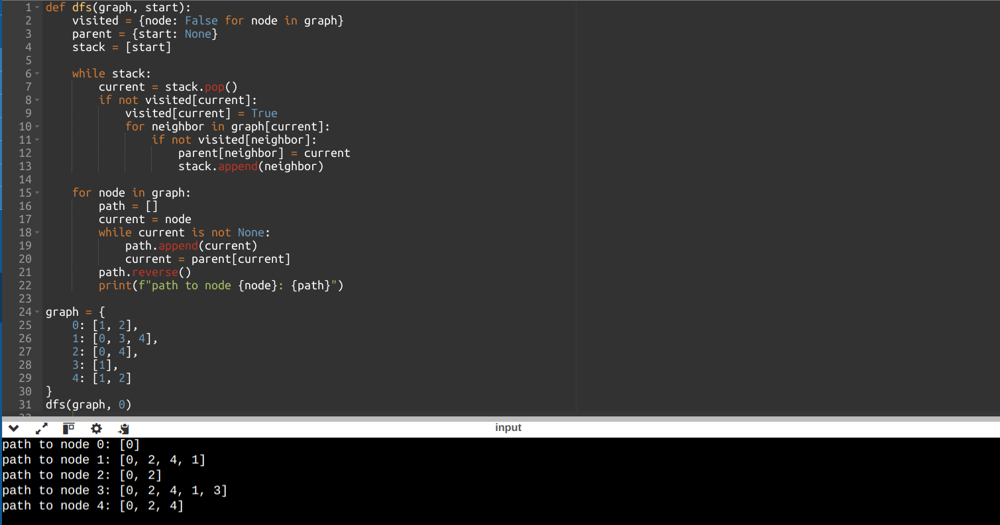
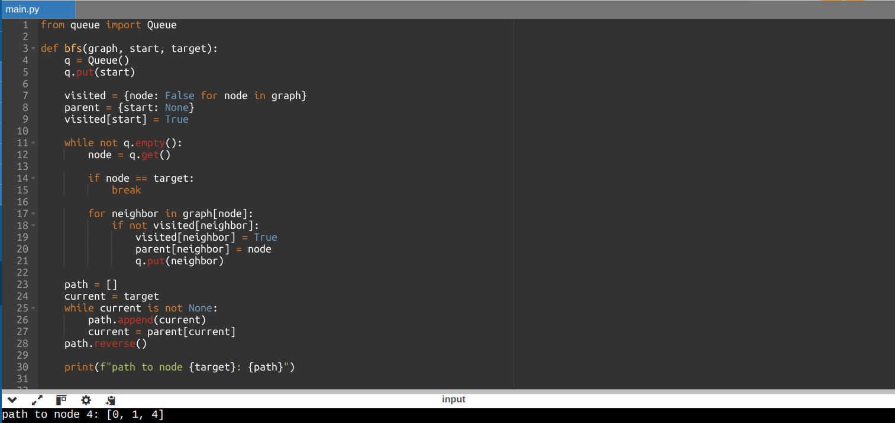

# Implementation of DFS & BFS with printing the path to the target node

The idea is to maintain a parent map that maps each node to it's corresponding parent node.

The traversal stops after reaching the target node , then the path to this node is constructed from the parent map and printed

Here is the output of DFS code

Here is the output of BFS code

